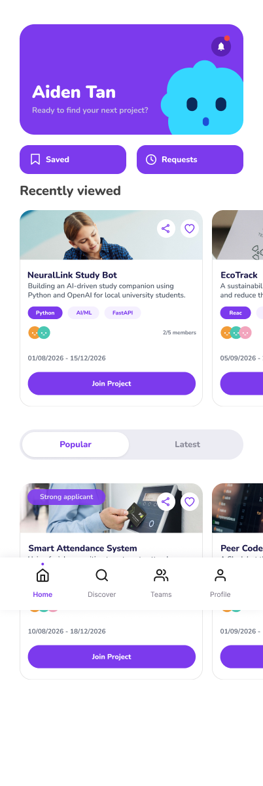
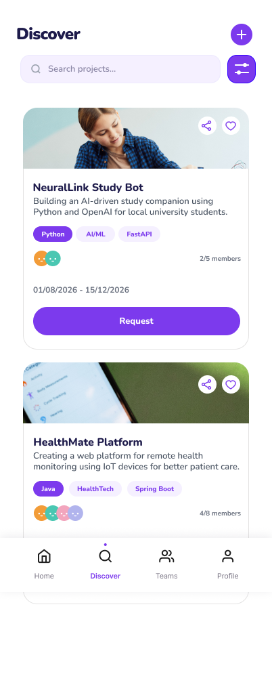
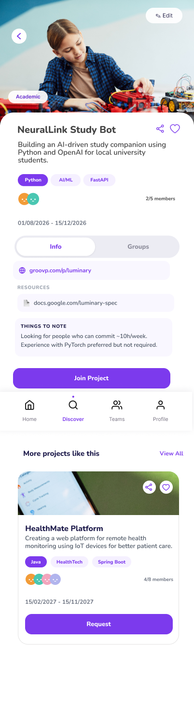
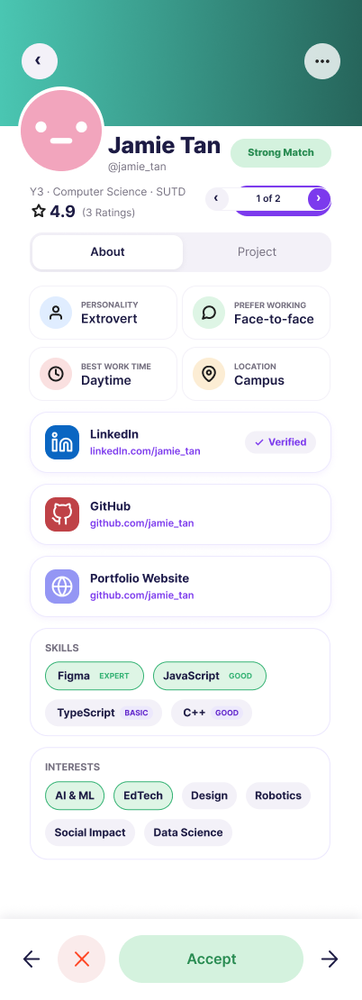

# Groovp

Groovp matches university students into project teams on skills, interests and
working style, and shows *why* each recommendation fits instead of handing over a
bare score.

**[Live app](https://groovp.vercel.app)** · **[Demo video](https://youtu.be/uGdm1_DHg8A)** · **[Figma](https://www.figma.com/design/wA2wiOAqWkKr9JI319d5wT/Groovp--new-)**

Built for 60.005 HCI & AI at SUTD, across three design iterations — paper
prototype, high-fidelity Figma prototype, then this: a real multi-user app with
90 screens, running on Postgres with row-level security.

| Home | Discover | Project details | Applicant review |
|---|---|---|---|
|  |  |  |  |

---

## What it does

- **Discover** — browse student projects, filtered by skill, interest, team size
  and campus, ranked by how many of your attributes overlap.
- **Groups** — a project holds multiple groups. Each advertises the skills,
  interests and working style it wants, so joining is a real choice between
  teams rather than a single yes/no.
- **Applicant review** — a group leader sees each applicant's profile with the
  matching attributes highlighted, and a **Strong Match** badge when enough of
  them line up.
- **Afterwards** — end a project, rate teammates, and carry the finished project
  onto your profile.

## How matching works

`lib/matching.js` — an overlap count, not a learned model. That is deliberate:
usability testing found a compatibility *percentage* meant nothing to
participants ("questioned how a shown compatibility percentage affected
anything"), so the app shows the overlapping attributes themselves.

```js
export function computeMatch(applicant, group, { includePersonality = true } = {}) {
  const matchedSkills = overlap(group?.skills_wanted, applicant?.skills || []);
  const matchedInterests = overlap(group?.interests_wanted, applicant?.interests || []);
  const matchedPersonality = includePersonality
    ? overlap(group?.personality_wanted, applicantPersonalityTerms(applicant))
    : [];

  const overlapCount =
    matchedSkills.length + matchedInterests.length + matchedPersonality.length;

  return {
    overlapCount,
    isStrongMatch: overlapCount >= STRONG_MATCH_THRESHOLD, // 2
    matchedSkills,
    matchedInterests,
    matchedPersonality,
  };
}
```

Only the attributes that actually matched are highlighted — never the whole set.
The `includePersonality` flag is what the A/B experiment below switches off.

## Access control

Everything protected is enforced in Postgres policies, not in the interface.

A design and security audit late in the build found that the `Restricted` and
`Invite-only` project privacy tiers had been pure UI labels since v1:
`projects_read` was `using (true)` for every authenticated user, and nothing
downstream checked `privacy` either. `supabase/schema_v13.sql` makes them real:

- `public` — everyone.
- `restricted` — the owner, existing members, and anyone whose profile university
  matches the owner's.
- `invite-only` — the owner and existing members. Join-by-code deliberately
  bypasses the SELECT policy through a `SECURITY DEFINER` function that returns
  only `id` and `name`, so a guessed code leaks nothing else.

That tier is only meaningful because `university` is read-only and derived from
the verified signup email domain. It used to be a free-text profile field any
account could edit, which made every university-scoped rule spoofable.

## The web experiment

`app/experiment/*` and `lib/experiment.js` wrap the real app in a timed
between-subjects study — no forked screens, no duplicate flows. Two conditions:

- **A — Personalised:** working style is collected at signup and counts toward
  matching.
- **B — Neutral:** working style and location are hidden, and personality drops
  out of the score entirely (not just out of the display).

21 students across 5 universities took part. A beat B on every rated measure —
experience 4.4 vs 3.6, ease of use 4.1 vs 3.8, likelihood to reuse 4.0 vs 3.6 —
averaging 6:55 against 13:50. Directional only: n=10 and n=11, self-selected,
some sessions logged null timings, and two outliers were excluded.

Every experiment touch point in the app is tagged `EXPERIMENT:` so the whole
thing is a grep away from removal; `lib/experiment.js` lists the exact files.

## Stack

Next.js 14 (App Router, plain JS/JSX) · Tailwind · Supabase (Postgres, Auth,
Storage, RLS) · Vitest · Vercel.

## Repo map

```
app/            50 routes — auth, home, discover, project, groups, teams,
                profile, settings, moderation, tutorial, experiment
components/     63 components. PhoneFrame wraps every page (402x874 device frame)
lib/            matching, capacity, profile completeness, notifications,
                experiment instrumentation, Supabase clients
lib/*.test.js   Vitest unit tests for matching and completeness
supabase/       schema.sql + schema_v2..v14 (additive migrations), showcase seed,
                ad-hoc reporting queries
docs/DEVLOG.md  build log — why decisions were made, not just what shipped
```

## Running locally

```bash
npm install
cp .env.example .env.local   # fill from Supabase -> Project Settings -> API
npm run dev                  # http://localhost:3000
```

```bash
npm test                     # Vitest
```

Database: run `supabase/schema.sql` in the Supabase SQL editor, then
`schema_v2.sql` through `schema_v14.sql` in order — they are additive migrations,
not replacements. `supabase/seed_showcase.sql` loads the demo dataset
(30 profiles, 20 projects, 40 groups).

> Known limitation: behind a TLS-intercepting proxy, server-side Supabase calls
> fail locally with `UNABLE_TO_GET_ISSUER_CERT_LOCALLY`. Every database read is
> wrapped `try/catch -> []` so pages still render, but real data only appears on
> a deployed instance.

## License

MIT — see [LICENSE](LICENSE).
